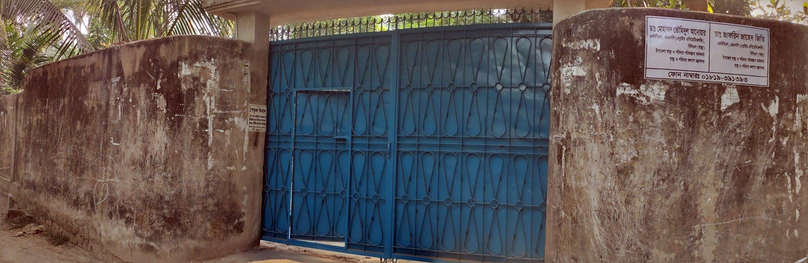

# ডাক্তার বাড়ি, বাঁশখালী, চট্টগ্রাম 

## প্রতিষ্ঠাতা: 
**কৃষিবিদ(অব.) মোহাম্মদ নূরুল আনোয়ার** 
 Ex-Superintendent, Dept of Agricultural Extension, Horticulture Center, Dewanhat, Chattogram 
 
**সহধর্মিণী: মাকসুদা বেগম সরকার**

যোগাযোগ: ০১৮১৫-৩৮৩২৩০ 

### ডাক্তার বসেন 

**ডা. তৌহিদুল আনোয়ার**
MBBS (CMC), FCPS; BCS, UH&FPO, Ghoraghat, Dinajpur 

&nbsp;&nbsp;&nbsp;&nbsp;&nbsp;&nbsp;&nbsp;&nbsp;**সহধর্মিণী: ডা. জাফরিন জাহেদ**
MBBS (CMC), FCPS; BCS, UH&FPO, Gobindaganj, Gaibandha

**সিরিয়াল: ০১৮১৯-৩৯১৩৯৩**